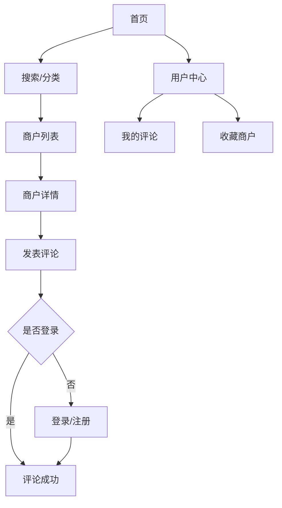

## 1. 产品概述

简化版大众点评网站，为用户提供商户信息浏览、评分评论、搜索筛选功能。帮助用户快速找到优质商户，同时为商户提供展示平台。

目标用户：寻找本地服务的消费者和希望获得曝光的本地商户。

## 2. 核心功能

### 2.1 用户角色

| 角色   | 注册方式      | 核心权限               |
| ---- | --------- | ------------------ |
| 普通用户 | 邮箱/手机号注册  | 浏览商户、发表评论、收藏商户     |
| 商户用户 | 邮箱注册+资质认证 | 管理店铺信息、回复评论、查看统计数据 |

### 2.2 功能模块

核心页面包括：

1. **首页**：商户推荐、分类导航、搜索入口
2. **商户列表页**：分类筛选、搜索结果、排序功能
3. **商户详情页**：基本信息、评分展示、评论列表
4. **用户中心**：个人资料、我的评论、收藏列表
5. **登录注册页**：账号注册、密码登录

### 2.3 页面详情

| 页面名称  | 模块名称 | 功能描述                   |
| ----- | ---- | ---------------------- |
| 首页    | 搜索栏  | 输入关键词搜索商户，支持地理位置自动定位   |
| 首页    | 分类导航 | 展示餐饮、购物、娱乐等分类入口        |
| 首页    | 推荐商户 | 基于评分和热度展示优质商户卡片        |
| 商户列表页 | 筛选器  | 按分类、地区、价格区间筛选商户        |
| 商户列表页 | 商户卡片 | 展示商户图片、名称、评分、人均消费      |
| 商户详情页 | 基本信息 | 显示地址、电话、营业时间、商户介绍      |
| 商户详情页 | 评分模块 | 展示综合评分、各维度评分（环境、服务、口味） |
| 商户详情页 | 评论列表 | 显示用户评论、评分、图片，支持点赞      |
| 用户中心  | 个人资料 | 编辑昵称、头像、联系方式           |
| 用户中心  | 我的评论 | 查看和管理自己发表的所有评论         |
| 登录注册页 | 注册表单 | 邮箱验证、密码强度检测            |
| 登录注册页 | 登录表单 | 支持邮箱/手机号+密码登录          |

## 3. 核心流程

### 用户浏览流程

用户进入首页 → 搜索或选择分类 → 浏览商户列表 → 点击商户查看详情 → 阅读评论和评分 → 注册登录后可发表评论

### 商户管理流程

商户注册 → 提交资质认证 → 完善店铺信息 → 回复用户评论 → 查看经营数据

## 4. 用户界面设计

### 4.1 设计风格

* 主色调：橙色（#FF6B35）配白色背景

* 辅助色：深灰色（#333333）用于文字，浅灰色（#F5F5F5）用于背景

* 按钮风格：圆角矩形，主要操作用橙色，次要操作用边框样式

* 字体：系统默认字体，标题18px，正文14px，小字12px

* 布局：卡片式布局，网格系统，留白充分

* 图标：使用简洁线性图标，统一风格

* 产品名称：现在，开饭啦！

### 4.2 页面设计概览

| 页面名称  | 模块名称 | UI元素                |
| ----- | ---- | ------------------- |
| 首页    | 搜索栏  | 白色圆角输入框，橙色搜索按钮，位置图标 |
| 首页    | 分类导航 | 圆形彩色图标+文字，4列网格布局    |
| 商户列表页 | 商户卡片 | 圆角卡片，左侧图片，右侧信息，星级评分 |
| 商户详情页 | 评分展示 | 大号数字评分+五星显示，饼图展示各维度 |
| 用户中心  | 功能入口 | 列表式布局，右侧箭头指示，分割线分隔  |

### 4.3 响应式设计

采用桌面端优先设计，移动端适配：

* 桌面端：1200px容器宽度，多列布局

* 平板端：768px断点，双列布局

* 手机端：375px断点，单列布局，触摸优化

* 图片懒加载，减少初始加载时间

* 支持手势操作：滑动切换、下拉刷新

