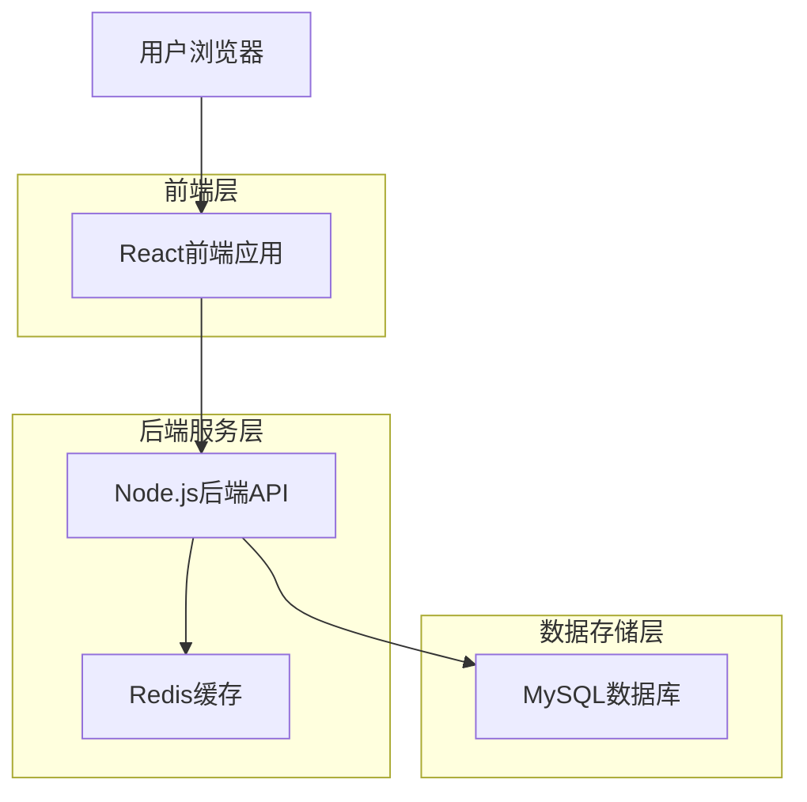
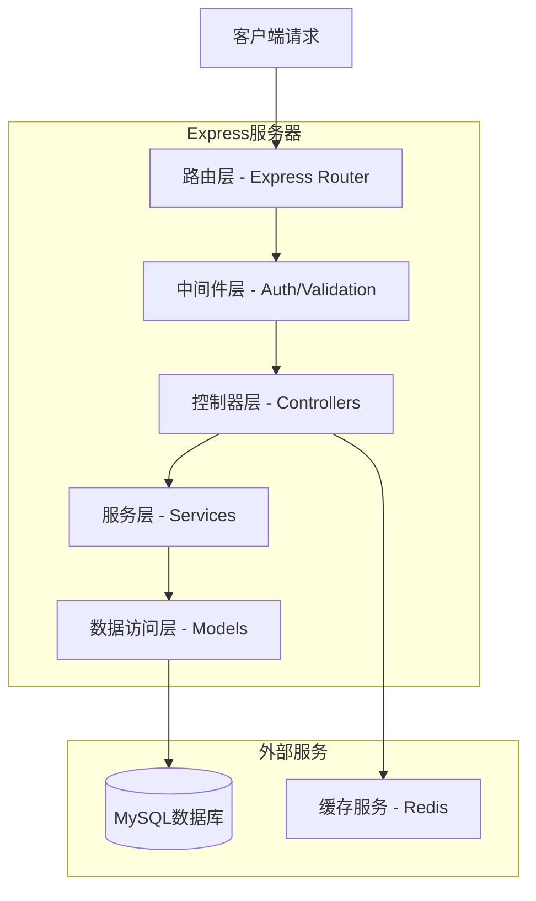
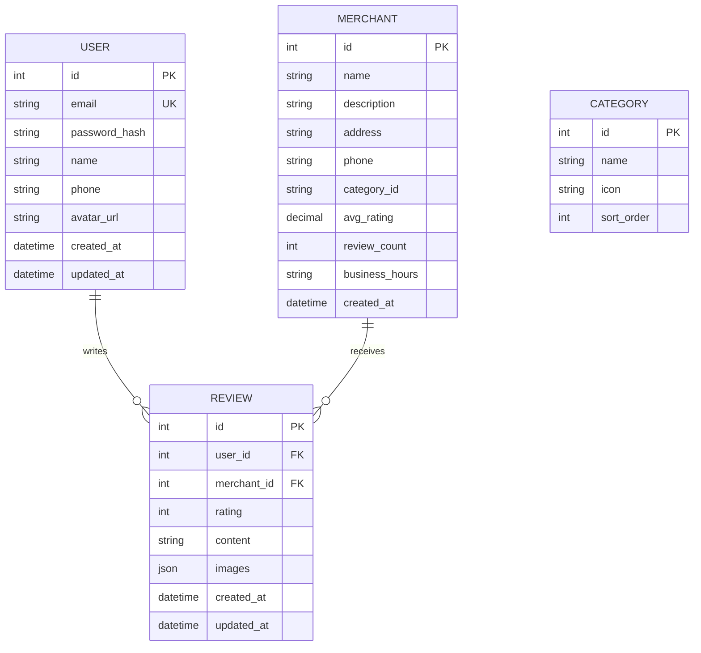

## 1. 架构设计



## 2. 技术描述

- 前端：React@18 + Ant Design@5 + Vite@4
- 初始化工具：vite-init
- 后端：Node.js@18 + Express@4 + TypeScript
- 数据库：MySQL@8.0
- 缓存：Redis@7.0
- 测试框架：Jest + Supertest
- 文档工具：Swagger/OpenAPI 3.0

## 3. 路由定义

| 路由 | 用途 |
|------|------|
| / | 首页，展示推荐商户和搜索入口 |
| /search | 搜索结果页，展示筛选后的商户列表 |
| /category/:id | 分类页面，展示特定分类的商户 |
| /merchant/:id | 商户详情页，展示商户信息和评论 |
| /login | 登录页面 |
| /register | 注册页面 |
| /profile | 用户中心，个人资料和管理 |
| /my-reviews | 我的评论管理页面 |

## 4. API定义

### 4.1 用户认证API

**用户注册**
```
POST /api/auth/register
```

请求参数：
| 参数名 | 参数类型 | 是否必需 | 描述 |
|--------|----------|----------|------|
| email | string | 是 | 用户邮箱 |
| password | string | 是 | 密码（6-20位） |
| name | string | 是 | 用户昵称 |
| phone | string | 否 | 手机号 |

响应示例：
```json
{
  "code": 200,
  "message": "注册成功",
  "data": {
    "userId": "123456",
    "token": "jwt_token_here"
  }
}
```

**用户登录**
```
POST /api/auth/login
```

请求参数：
| 参数名 | 参数类型 | 是否必需 | 描述 |
|--------|----------|----------|------|
| email | string | 是 | 用户邮箱 |
| password | string | 是 | 密码 |

### 4.2 商户API

**获取商户列表**
```
GET /api/merchants
```

查询参数：
| 参数名 | 参数类型 | 是否必需 | 描述 |
|--------|----------|----------|------|
| page | number | 否 | 页码，默认1 |
| limit | number | 否 | 每页数量，默认20 |
| category | string | 否 | 分类ID |
| keyword | string | 否 | 搜索关键词 |
| sort | string | 否 | 排序方式：rating/distance/price |

**获取商户详情**
```
GET /api/merchants/:id
```

### 4.3 评论API

**发表评论**
```
POST /api/reviews
```

请求参数：
| 参数名 | 参数类型 | 是否必需 | 描述 |
|--------|----------|----------|------|
| merchantId | string | 是 | 商户ID |
| rating | number | 是 | 评分（1-5） |
| content | string | 是 | 评论内容 |
| images | array | 否 | 图片URL数组 |

**获取商户评论列表**
```
GET /api/reviews/merchant/:merchantId
```

## 5. 服务器架构图



## 6. 数据模型

### 6.1 数据模型定义



### 6.2 数据定义语言

**用户表 (users)**
```sql
CREATE TABLE users (
    id INT PRIMARY KEY AUTO_INCREMENT,
    email VARCHAR(255) UNIQUE NOT NULL,
    password_hash VARCHAR(255) NOT NULL,
    name VARCHAR(100) NOT NULL,
    phone VARCHAR(20),
    avatar_url VARCHAR(500),
    created_at TIMESTAMP DEFAULT CURRENT_TIMESTAMP,
    updated_at TIMESTAMP DEFAULT CURRENT_TIMESTAMP ON UPDATE CURRENT_TIMESTAMP,
    INDEX idx_email (email)
);
```

**商户表 (merchants)**
```sql
CREATE TABLE merchants (
    id INT PRIMARY KEY AUTO_INCREMENT,
    name VARCHAR(200) NOT NULL,
    description TEXT,
    address VARCHAR(500) NOT NULL,
    phone VARCHAR(20),
    category_id INT NOT NULL,
    avg_rating DECIMAL(3,2) DEFAULT 0.00,
    review_count INT DEFAULT 0,
    business_hours VARCHAR(200),
    created_at TIMESTAMP DEFAULT CURRENT_TIMESTAMP,
    INDEX idx_category (category_id),
    INDEX idx_rating (avg_rating DESC),
    FOREIGN KEY (category_id) REFERENCES categories(id)
);
```

**评论表 (reviews)**
```sql
CREATE TABLE reviews (
    id INT PRIMARY KEY AUTO_INCREMENT,
    user_id INT NOT NULL,
    merchant_id INT NOT NULL,
    rating TINYINT CHECK (rating >= 1 AND rating <= 5),
    content TEXT NOT NULL,
    images JSON,
    created_at TIMESTAMP DEFAULT CURRENT_TIMESTAMP,
    updated_at TIMESTAMP DEFAULT CURRENT_TIMESTAMP ON UPDATE CURRENT_TIMESTAMP,
    INDEX idx_user_merchant (user_id, merchant_id),
    INDEX idx_merchant_created (merchant_id, created_at DESC),
    FOREIGN KEY (user_id) REFERENCES users(id) ON DELETE CASCADE,
    FOREIGN KEY (merchant_id) REFERENCES merchants(id) ON DELETE CASCADE
);
```

**分类表 (categories)**
```sql
CREATE TABLE categories (
    id INT PRIMARY KEY AUTO_INCREMENT,
    name VARCHAR(50) NOT NULL,
    icon VARCHAR(100),
    sort_order INT DEFAULT 0,
    created_at TIMESTAMP DEFAULT CURRENT_TIMESTAMP
);

-- 初始化分类数据
INSERT INTO categories (name, icon, sort_order) VALUES
('餐饮美食', '🍽️', 1),
('购物商城', '🛍️', 2),
('娱乐休闲', '🎬', 3),
('生活服务', '🏠', 4),
('酒店住宿', '🏨', 5);
```

### 6.3 性能优化策略

1. **数据库优化**
   - 创建复合索引：idx_merchant_rating, idx_user_reviews
   - 使用覆盖索引减少回表查询
   - 定期分析和优化慢查询

2. **缓存策略**
   - Redis缓存热门商户信息（TTL: 1小时）
   - 缓存用户会话信息（TTL: 24小时）
   - 分页缓存商户列表（TTL: 15分钟）

3. **前端优化**
   - 图片懒加载和压缩
   - 组件级代码分割
   - API请求防抖和节流
   - 使用Service Worker缓存静态资源